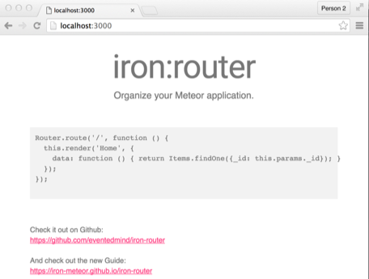

# fuse-demo

Application to demonstrate use of [fuse](https://github.com/kctang/fuse), [form-handler](https://github.com/kctang/form-handler) and [mdl-ui](https://github.com/kctang/mdl-ui).

# Guide

This guide provides describes how to create an application with the following capabilities:

* Create, edit, delete messages with a form validation
* List & search messages
* Message module with a schema definition
* Facebook, Google and password based login support with profile merging
* Application layout, form and user interface that uses Material Design Lite (MDL) 

Checkout this [video demo](http://bit.ly/21y8u19) of the application. Let's get going.
    
## Create Application & Add Packages

    # create meteor application
    meteor create test-1

    # remove generated sample files and unwanted packages
    cd test-1
    rm test-1.*
    meteor remove autopublish insecure
    
    # add packages used in demo
    meteor add kctang:fuse kctang:mdl-ui kctang:form-handler

    # add related core meteor packages
    meteor add stylus accounts-google accounts-facebook accounts-password
    
    # add dependent third party packages
    meteor add msavin:mongol zodiase:mdl momentjs:moment useraccounts:mdl

// TODO: [useraccounts:mdl](https://github.com/meteor-useraccounts/mdl) has not been published so need to link as local package

Now, the packages (building blocks) are in place but you have not developed your application. So, this is what you will see when accessing http://localhost:3000/:

## Configure Google/Facebook Login

To configure Google/Facebook login integration, create `server/configure.js`:

    Fuse.SecurityService.configure({
      //-- replace xxx values and add accounts-google package
      google: {
        clientId: 'xxx',
        secret: 'xxx'
      },
    
      //-- replace xxx values and add accounts-facebook package
      facebook: {
        appId: 'xxx',
        secret: 'xxx'
      }
    });

## Configure main.js File

Create main.js:

    Router.configure({
      // use mdlUiAppLayout defined by mdl-ui package
      layoutTemplate: 'mdlUiAppLayout'
    });
    
    Router.route('/', {
      name: 'home',
      template: 'home'
    });
    
    MdlUi.configure({
      title: 'Demo Application',
      
      // drawer will be rendered using this template if user is NOT logged in (optional)
      publicDrawer: 'appDrawerPublic',
      
      // drawer will be rendered using this template if user is logged in (optional)
      drawer: 'appDrawer',
    
      // true displays search button in application's toolbar
      search: true
    });
    
    // initialize services/packages
    Fuse.SecurityService.init();
    MdlUi.init();
    
    // initialize the Message module
    Message.init();
    
[iron-router](https://iron-meteor.github.io/iron-router/) package is used to configure application routing. 

## Create Home & Application Drawer Templates

[mdlUiAppLayout](https://github.com/kctang/mdl-ui/blob/master/layouts/app/app-layout.html) layout template defined in main.js provides the application layout structure.

Create `home` template at:

* [client/home](https://github.com/kctang/fuse-demo/tree/master/client/home)

Next, create the application drawers at:

* [client/app-drawer](https://github.com/kctang/fuse-demo/tree/master/client/app-drawer)

## Create Message Module

Up to this point, we have have been doing mostly boilerplate configuration that applies to most applications.

The next step is to create the message module. Typical structure module files:

    /                                   // application root
      lib/
        schemas/
          xxx-schema.js                 // module schema
      xxx/                              // module directory
        client/
          xxx-client.js                 // module configuration for client
          ...                           // all other client only files for module xxx
        server/
          xxx-server.js                 // module configuration for server
          ...                           // all other server only files for module xxx
        xxx.js                          // module configuration for client & server
        xxx-routes.js                   // route definitions for module

File naming convention:

* Use lowercase. Dash for word separator.
* Special postfix words for easy file lookup from IntelliJ/IDE (e.g. -schema, -client, -server, -routes).

### Create Schema

Use [SimpleSchema](https://github.com/aldeed/meteor-simple-schema) package to design application's schemas.

For this demo, create `lib/schemas/message-schema.js`:

    Schemas = {};
    
    Schemas.Message = new SimpleSchema([
        Fuse.Schemas.Owner,
        Fuse.Schemas.Timestamp,
        Fuse.Schemas.TitleDesc,
        Fuse.Schemas.Hashtag
    ]);

The first line defines a global namespace called `Schemas` that can be referenced within the application. It then creates a `SimpleSchema` definition for `Schemas.Message` using a number of reusable schemas provided by `fuse` package. 

When resolved, Message's schema looks like this:

    Schemas.Message = new SimpleSchema({
      // from Fuse.Schemas.Owner
      owner_id: {type: String},
      owner_name: {type: String}
      
      // from Fuse.Schemas.Timestamp
      createdAt: {type: Date, optional: true},
      updatedAt: {type: Date, optional: true}
      
      // from Fuse.Schemas.TitleDesc
      title: {type: String},
      desc: {type: String}
      
      // from Fuse.Schemas.Hashtag
      tags: {type: [String], optional: true}
    });

### Module Configuration

Main module configuration is to define the schema to use:

    // message.js
    Message = Fuse.Module('message', {
      schema: Schemas.Message,            // use Schemas.Message as this module's schema (for validation and form field resolution)
      timestampable: true                 // auto populate createdAt and updatedAt fields for this module
    });
    
If custom collection subscription rules are needed, this should be done in client only module configuration:
 
    // client/message-client.js
    Message = Fuse.Module('message', {
      subscribe: {
        active: true,
        arguments: function () {
          return {
            // subscribe everything
            // TODO: demo subscribe to subset of published records
          };
        }
      }
    });

If custom collection publishing rules are needed, this should be done in server only module configuration:
 
    // server/message-server.js
    Message = Fuse.Module('message', {
      publish: {
        active: true,
        selector: function (arguments) {
          // publish everything
          return {};
        },
        findOptions: {
          sort: [
            ['title', 'asc']
          ]
        }
      }
    });

With the configuration of this module setup, it just need to be initialized via Message.init() in main.js. This mechanism is used to conform to Meteor's [file load order](http://docs.meteor.com/#/full/structuringyourapp).

### Module Route Configuration

Create this module's routes at:

* [message/message-routes.js](https://github.com/kctang/fuse-demo/blob/master/message/message-routes.js)

### Create Module Templates 

Message module's templates are located in [message/client](https://github.com/kctang/fuse-demo/tree/master/message/client). There is only two templates.

#### Message Listing

`message.html` renders message listing. 

#### Message Form 

`message-form.html` renders message form.

`mdl-ui` package is used render Material Design Lite (MDL) themed form fields and controls (e.g. mdlUiSection).

    <template name="messageForm">
      

        {{#formHandler}}
          

            {{>mdlUiText name="title" cell=12}}
            {{>mdlUiTextarea name="desc" cell=12}}
            {{#mdlUiSection name="tags" cell=12}}
              {{>mdlUiText name="tags.$" indexes=index cell=12}}
            {{/mdlUiSection}}
          

          

            <button type="submit" class="post mdl-button mdl-button--colored mdl-js-button mdl-js-ripple-effect">Post</button>
            <button type="button" class="cancel mdl-button mdl-button--colored mdl-js-button mdl-js-ripple-effect">Cancel</button>
          

        {{/formHandler}}
      

    </template>

It uses [form-handler](https://github.com/kctang/form-handler) package to create and update message documents:
    
    Template.messageForm.onCreated(function () {
      FormHandler.add(this, {
        debug: true,
        schema: Schemas.Message,
        load() {
          return this.id ? Message.collection.findOne(this.id) : {};
        },
        beforeValidate(modifier) {
          var doc = modifier.$set;
          var user = Meteor.user();
          doc.owner_id = user._id;
          doc.owner_name = user.profile.name;
        },
        save(parsedDoc, modifier) {
          if (this.id) {
            Message.collection.update(this.id, modifier);
            var editMode = Session.get('editMode');
            Session.set('editMode', _.without(editMode, this.id));
          } else {
            Message.collection.insert(modifier.$set);
            Session.set('newMessageForm', false);
          }
        }
      });
    });
